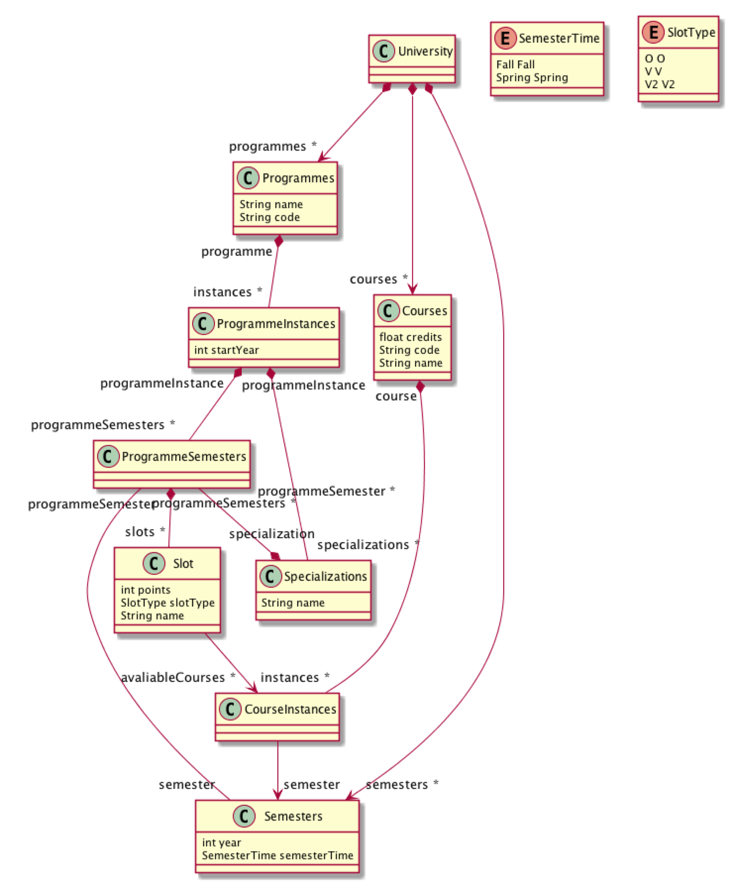

# TDT4250

## Model



The model is built with a few classes that have a general class and an instance class. The instance classes are meant to represent individual years that the classes are being used.

- Progammes: A study programme in general. E.g. code="MTDT" and name="Datateknologi"
- ProgrammeInstances: A programme instance for a specific year. E.g. MTDT with startDate 2016
- ProgrammeSemesters: The individual semesters that a ProgrammeInstance is made of. E.g. the spring 2019 semester for MTDT 2016.
- Semesters: A semester in general. CourseInstances and ProgrammeSemesters are linked to a semester, but a semester is not dependent on any programme or course. E.g. spring 2019
- Courses: A course in general with it's code, name and number of credits. E.g. TDT4250
- CourseInstances: A course in a specific semester. E.g. TDT4250 for spring 2019.

An example is the progamme MTDT (with class Programmes) and MTDT 2019 (with class ProgrammeInstance). The programme MTDT would have one ProgrammeInstance per year the programme has existed. Each of those programme instances (e.g. MTDT starting in 2016) would have 10 programmeSemesters, since the programme is 5 years long. Each course (E.g. TDT4250) will have a CourseInstance for each semester the course will run. Each of the 10 ProgrammeSemesters would have enough courseInstances to make 30 credits.

## Constraints

A simple constraint is added to the semester year via Java code. It checks if the semester is between the year NTNU was founded and year 2500.

In `UniversityValidator.java`:

```java
/**
    * Validates the validYear constraint of '<em>Semesters</em>'.
    * <!-- begin-user-doc -->
    * Checks if the semester is from a year since NTNU was founded and year 2500.
    * <!-- end-user-doc -->
    * @generated NOT
    */
public boolean validateSemesters_validYear(Semesters semesters, DiagnosticChain diagnostics, Map<Object, Object> context) {
    if (semesters.getYear() >= 1760 && semesters.getYear() <= 2500) {
        return true;
    }
    return false;
}
```
