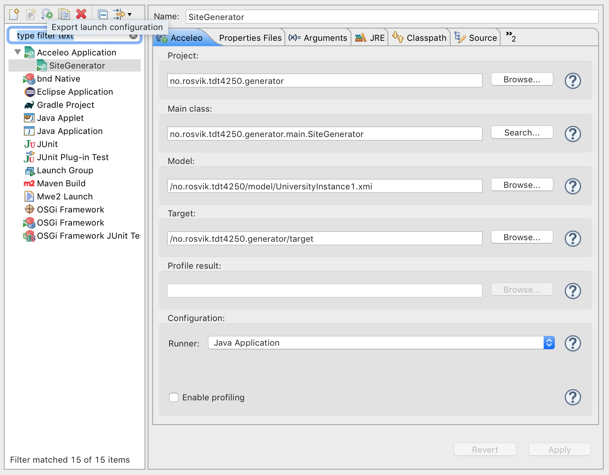

# Assignment 3

## Structure

This assignment is based on the Acceleo, and I used [the official getting started guide](https://wiki.eclipse.org/Acceleo/Getting_Started) to set up my project. The model is the same as the one from assignment 1, but I added a name field to Universities, and made a more complete model instance.

A live demo of the project is available on here: https://rosvik.github.io/TDT4250/assignment3/no.rosvik.tdt4250.generator/target/NTNU.html

## Running

Running the project:

1. Open `assignment3/no.rosvik.tdt4250.generator` and `assignment1/no.rosvik.tdt4250` in Eclipse. You might be asked to import the university package in `SiteGenerator.java`.
2. Right click `SiteGenerator.mtl` in `no.rosvik.tdt4250.generator.main` and select "Run As -> Run Ronfigurations...".
3. Use the following configuration:

4. Click "Apply", then "Run".
5. The generated HTML file will appear in the `target` folder.
